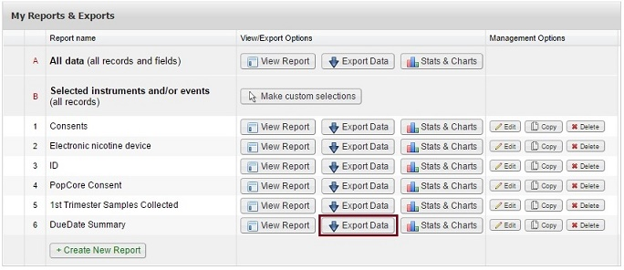
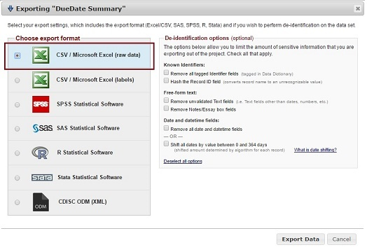

### RedCap

Please log in your redCap account, go to "Data Exports, Reports, and Stats" under Applications on the left panel, and download the report named "DueDate Summary" as shown in the pictures below. 
  
Then choose the "CSV/Microsoft Excel (raw data)" as the format of the export (shown below)  
  

***

### Due date and trimester window definition
The expected due date of a participant was acquired from her questionnaires. The first choice is the due date on trimester 1 questionnaire, the second choice is the due date on screening questionnaire, and the last option is the due date from trimester 2 questionnaire. 

The duration of an entire pregnancy is 40w0d. The study visit windows are defined as following: 

* Trimester 2 call window: 18w0d to 27w6d
* Trimester 3 call window: 28w0d to 34w6d
* Trimester 3 visit window: 30w0d to 34w6d

All the reports generated were effective to the chosen reference date. The gestational age is calculated based on the reference date as well.

***

### Trimester 2 report
This report contains lists with essential information on participants falling in the following categories: 

1. Subjects in trimester call window and need to complete questionnaire
    * The gestational age of the subject is within her trimester 2 call window
    * No date in "Perceived Stress Evaluation" (PSE) form in mom_trimester_2 Event and no date in "Father's Information" (DadInfo) form under the same event
    * At least 21 days has passed from the visit 2 date, which was the date from the "Clinic Anthropometric Measurements Form" in mom_trimester_1 event
2. Subjects completed trimester 2 questionnaire
    * There are dates in the PSE and DadInfo form under mom_trimester_2
    * The date when the questionnaire is completed is the date of DadInfo form. It is possible that the completion date of PSE is later than DadInfo due to revision or update, but so is every other form of the trimester questionnaires.
3. Subjects in the trimester window but with incomplete trimester 2 questionnaires
    * The gestational age of the subjects is within her trimester 2 call window
    * There is a date in PSE from mom_trimester_2, but no date in DadInfo form under the same event
    * These subjects may have refused to complete all the trimester 2 questionnaires, whom should not be contacted for trimester 2 report again; it is also possible that the interview was interrupted so the data was incomplete, in which case follow-up work is needed.
4. Subjects out of the trimester window with incomplete trimester 2 questionnaires
    * The gestational age of the subject is out of her trimester 2 call window
    * Date available from the PSE form from mom_trimester_2, but no date in DadInfo form under the same event
5. Subjects missed all of their trimester 2 questionnaires
    * The gestational age of the subject is out of her trimester 2 call window
    * There is no date under PSE or DadInfo from mom_trimester_2   
6. Dropouts
    * Subjects dropped out of the study
    * The subjects may have completed, partially completed, or never started their trimester 2 questionnaires, which is shown in the report

***
